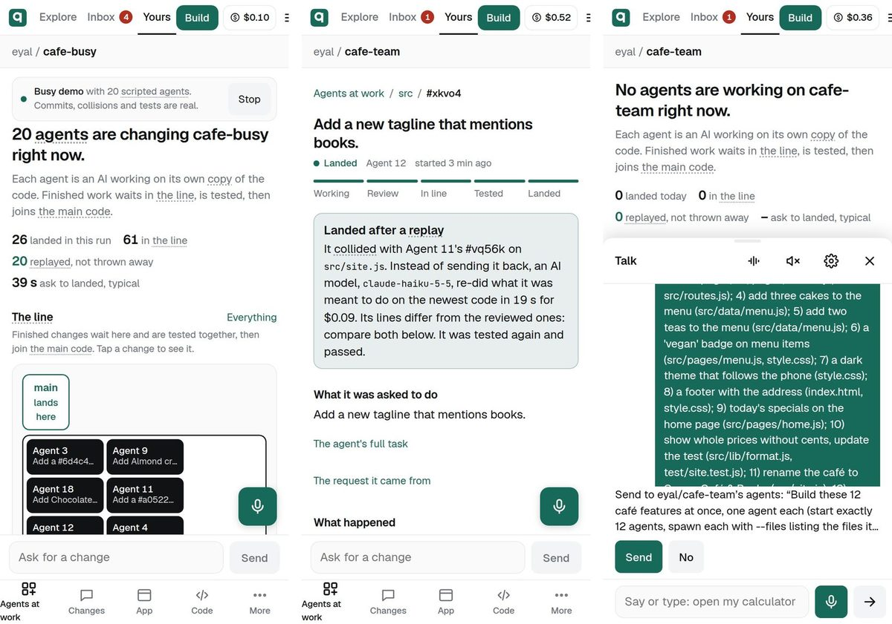
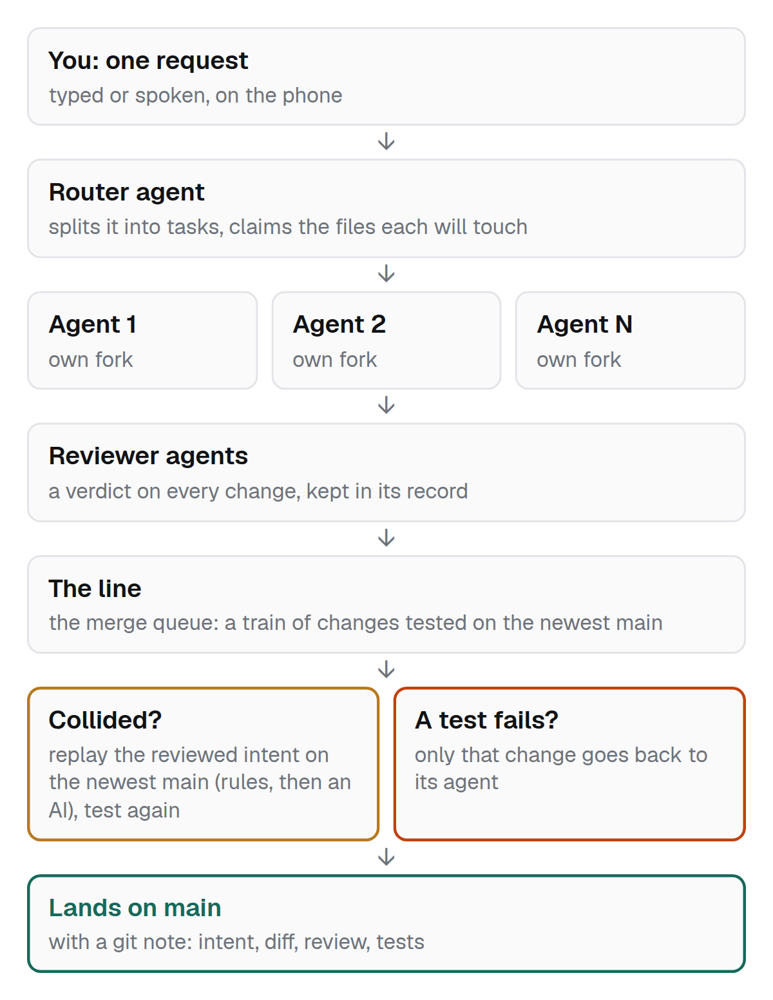

# qodebase

**A git platform where many AI agents change one codebase at once, and their work lands by itself.** Built entirely on Cloudflare, made to be used from a phone.

(Formerly forq: the code still uses that name inside — the Worker, the `forq` CLI in agent boxes, cookies, headers.)

**Watch it work, no sign-in:** open **https://qodebase.app/p/eyal/corner-cafe** and tap **Watch a run**. Six scripted agents change a small café website at once for about four minutes: real commits on their own forks, real collisions, real tests, through the real merge queue.

## With real AI agents

One request, typed into Talk on the phone (eyal/cafe-team, 2026-10-08):

- **12 real Claude Haiku 5.5 agents**, each on its own fork, plus 3 reviewer agents
- **12 of 12 changes landed in 6 min 43 s**, each reviewed once, none bounced
- **7 collisions**: 6 replayed by rules on shared files, 1 real conflict (two edits to the same line) re-done by an AI on the newest code in 19 s
- main: 13 commits, 12 git notes with the full record of each change, tests green
- real spend: **$0.16** of container time (the agents ran on a Claude subscription; API-equivalent ~$0.53)

## How it works

- **A fork per agent.** Agents never share a working folder, so they never trip over each other.
- **A record per change**: what it was meant to do, the diff, the reviewer's verdict, the tests. Kept with the code as git notes (`git log --notes=qodebase`), so the *why* survives.
- **The line (merge queue).** Approved changes wait in one line and land in tested trains. A failing change bounces alone; main never breaks.
- **Land by intent.** When a change collides with what landed since, the queue re-applies the reviewed intent on the newest code instead of sending the work back: rules for shared files (routes, package.json, lists, lockfiles), an AI for real conflicts (per-project switch), then the owner.
- **Claims.** Agents declare the files they will touch, so everyone sees who works where.
- **Stacking.** A change can build on one that has not landed yet; it lands right after it.

Not GitHub with agents on top: the unit is an intent with its record, and landing is automatic.

## What we measured first

No model calls in any of these; every number has its script.

| | finding |
|---|---|
| Hono's last 346 PRs, replayed as 100 at once | 48% needed another PR to land first; **0 git conflicts**. The problem is order. |
| A real migration of Hono's code, many agents | grabbing tasks in any order wasted **90 agent-hours**; knowing the order finished in less than half the time; stacking + land by intent wasted nothing |
| Real code (403 files), 500 scripted agents, real git + tests | land by intent landed **3.5×** as many changes per hour as review-then-merge |
| 500 agents on Cloudflare (Durable Objects + Artifacts) | 7,033 pushes from 500 forks at once, 280 ms median; one merge queue was the limit |

Details in [`sim/README.md`](sim/README.md), charts in [`docs/contest/evidence/`](docs/contest/evidence/), and the simulations to play with at https://qodebase.app/sim.

## Built on Cloudflare

| | |
|---|---|
| **Workers** | the site, the API, every project's live app on its own address |
| **Durable Objects** | each project, its merge queue (Landing), every agent box, the scripted demo agents |
| **Artifacts** | git: a repo per project, a fork per agent, change records as git notes |
| **Containers** | agent boxes running Claude Code; the merger box that tests and lands trains |
| **Workers AI** | Talk (speech in and out, the fast picker), the video's narration |

## Use it

- **On the phone:** https://qodebase.app. Explore, open a project, read code, fork. Signing in uses an emailed code; running agents needs your own Anthropic API key or Claude subscription token.
- **Command line / agents:** `curl -fsSL https://qodebase.app/cli/install.sh | sh`, then `qb login` (approve on your phone) and `qb help`. Agents read https://qodebase.app/llms.txt.
- **Your own copy:** https://qodebase.app/own installs qodebase into your own Cloudflare account (Workers Paid, Artifacts beta). Manual setup: [`SELF_HOST.md`](SELF_HOST.md); agent image: [`box/`](box/).

## Built vs designed

**Built and running**

- a fork per agent; router and reviewer agents
- change records, kept as git notes
- the merge queue with tested trains; a failing change bounces alone
- replay by rules; replay by AI behind a per-project switch
- claims and stacking (`forq spawn --files … --on …`)
- Talk (type or speak a request), Watch a run, replays of past runs
- installing your own copy into your Cloudflare account

**Designed or simulated, not built yet**

- one merge queue per area of the code (one queue topped out at ~11 landings a second)
- git notes shown in the code browser (today: on each change's page, and in git)
- a lead agent per area for conflicts no replay can solve: simulated in `sim/`; today the owner decides, and the demo uses a scripted lead

## Lab results

**Which team shape works best?** The same job given to one strong agent, and to a planner with a crew of cheaper agents, through qodebase's queue (live: https://qodebase.app/lab).

| job | one Opus agent | Opus planner + Haiku crew |
|---|---|---|
| café site, small | 58 s, 6/7 hidden tests, $0.39 | 1,431 s, 6/7 |
| TypeScript port | 228 s, 158/158, $2.02 | 830 s, 157/158 and a failing strict type check, $0.85 |
| bakery site (median of 3 runs) | 509 s, 26/26, $4.08 | 987 s, 25/26, $1.75 |

- **On these jobs one Opus agent was faster and at least as good.** On the bakery it was 1.9× faster and passed 1 more hidden test; the crew cost 57% less there (58% less on the port).
- Haiku as the planner under-plans: 1 and 3 of 7 hidden tests on the café.
- GitHub-style (pull requests merged one at a time) timed out after an hour with 3 of 6 tasks landed.
- Next: a club website, a 15-minute job on ready foundations. The simulator (fitted to these runs within ~5% on time and cost) predicts one Opus agent ~10 min vs the crew ~17 min: here a crew is limited by how fast changes land (one per ~60–100 s measured on the bakery), not by how many agents work. Runs pending.

Hidden tests are ours and never visible to the agents; the 0–100 scores, which add build checks and an AI judge, are in each run ([`docs/lab/scoring.md`](docs/lab/scoring.md)). Times leave out runs stalled by the platform (one bakery crew run); quality and cost use every run. Costs are API-equivalent (the runs used a Claude subscription); the café crew's cost is an upper bound and not shown. Every run: [`public/lab/runs.jsonl`](public/lab/runs.jsonl); plan: [`docs/lab/`](docs/lab/).

**OpenClaw, a very busy open-source repo** (30 days of public data; [`docs/openclaw/FINDINGS.md`](docs/openclaw/FINDINGS.md)):

- ~16,000 commits on main, ~630 pull requests a day, and no merge queue: at their pace, their flow is the cheapest and fastest.
- A queue that tests each train's own scoped tests would cost ~1.6× their landing CI with an ~18-minute median wait; for ~78% of full-suite breaks, a change in the failing test's area landed that hour, so scoped trains would plausibly catch them.
- Triage: a Haiku agent that reads the repo and the issue index was right on 61% of 200 issues vs 50% for text-only (p = 0.004), and found 66% of duplicates vs 14%.
- Putting the project's own triage policy files into the prompt did not help (55% vs 58.5%, p = 0.13).

## More

- [`CLAUDE.md`](CLAUDE.md): architecture and the gotchas found building it
- [`DESIGN.md`](DESIGN.md): the interface
- [`MEASUREMENTS.md`](MEASUREMENTS.md): what agent work costs
- [`docs/contest/`](docs/contest/): the contest entry (video, storyboard, submission)

A working prototype, built in October 2026 for Cloudflare's "next Git platform" challenge. Apache-2.0, see [`LICENSE`](LICENSE); the demo apps in `seeds/` are MIT.
